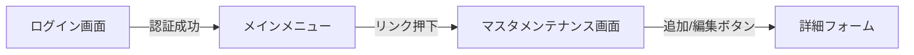

システム開発の設計段階で役立つ、シンプルかつ実践的な「マスタメンテナンス機能：ログイン・遷移仕様書」のサンプルを作成しました。

この形式であれば、開発チーム全員で共通認識を持ちやすく、実装の進捗管理にも適しています。

---

# マスタメンテナンス機能 実装仕様書

## 1. 概要
本機能は、管理者ユーザーがログインを経て、「都市マスタ（`scraped_cities`）」の追加・更新・削除を行うためのメンテナンス画面へ遷移する仕組みを提供する。

## 2. システム構成
* **言語/フレームワーク**: Python 3.9 / Flask 3.0.0
* **DB**: MySQL 8.0
* **認証**: セッションベースの簡易ログイン

## 3. 画面遷移図

## 4. 機能仕様

### 4.1. 認証機能 (Login)
* **URL**: `/login`
* **仕様**:
    * ユーザー名とパスワードを入力し、認証を行う。
    * 認証成功時、Flaskセッションを発行し、`/menu` へリダイレクトする。
    * 認証失敗時、エラーメッセージを表示し、再度ログイン画面を提示する。

### 4.2. メインメニュー (Menu)
* **URL**: `/menu`
* **仕様**:
    * 認証済みユーザーのみアクセス可能とする（`@login_required` 等の実装）。
    * 各メンテナンス機能へのリンクを配置する。
    * ログアウトボタンを設置し、セッションを破棄してログイン画面へ戻る。

### 4.3. マスタメンテナンス画面 (Maintenance)
* **URL**: `/maintenance`
* **仕様**:
    * `scraped_cities` テーブルのデータを一覧表示する。
    * 各行に対して以下の操作を配置する。
        * **[追加]**: 新規データ登録フォームへ遷移。
        * **[変更]**: 指定データの編集フォームへ遷移。
        * **[削除]**: 確認ダイアログを表示後、該当データを削除。

## 5. UI/UXの要件

画面レイアウトの詳細を見る

* **共通要素**: 全画面共通のヘッダーに「現在のログインユーザー名」を表示。
* **削除確認**: JavaScriptの `confirm()` を使用し、誤操作防止を徹底する。
* **レスポンシブ**: ブラウザ幅に応じてテーブル表示を最適化する。

## 6. セキュリティ対策 (OWASP Top 10対応)
1. **アクセス制御**: 全ての管理機能にセッションチェックを実装し、未認証時の直リンクアクセスを禁止する。
2. **インジェクション対策**: SQLAlchemyのORM機能を使用し、SQLを直接構築しないことでインジェクションリスクを排除する。
3. **セッション管理**: セッションIDの固定化防止と、適切なタイムアウト時間を設定する。

---

### 仕様書のポイント
* **Mermaid記法の活用**: `graph LR` を使うことで、遷移の流れをコードとして埋め込み、GitHub等で自動的に図として表示させています。
* **Detailsタグの利用**: 先ほど作成した折りたたみ機能を使用することで、詳細情報を隠し、パッと見の可読性を高めています。
* **セキュリティの明記**: セキュリティ要件を「意識高い開発者としての項目」として明記することで、後のトラブルを防ぎます。

この仕様書をベースに、チームの進め方に合わせて項目（エラーハンドリングの詳細や、DBの排他制御の有無など）を肉付けしていくのがおすすめです。さらに詳しく記載したい項目はありますか？